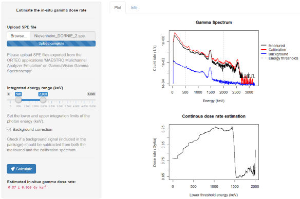

<!-- README.md is generated from README.Rmd. Please edit that file -->

```{r, include = FALSE}
knitr::opts_chunk$set(
  collapse = TRUE,
  comment = "#>",
  fig.path = "man/figures/README-"
)

## Examples
library(gammaSpec)
file <- system.file("extdata", "Nievenheim_DORNIE_1.spe", package = "gammaSpec")
``` 

# gammaSpec <a href='https://tzerk.github.io/gammaSpec/'></a>

<!-- badges: start -->
[](https://travis-ci.org/tzerk/gammaSpec)
[](https://ci.appveyor.com/project/tzerk/gammaspec)
<!-- badges: end -->

> [Find a full documentation of the package on the project page](https://tzerk.github.io/gammaSpec/)

## Overview

The **R** package 'gammaSpec' provides a small collection of functions to analyse
gamma spectra of NaI(Tl) scintillation radiation detectors.

## Installation

The ‘gammaSpec’ package is not available on the official CRAN servers.

However, the latest development builds can directly be installed from GitHub. Simply run the following from an R console

```{r, eval = FALSE}
if(!require("devtools"))
  install.packages("devtools")
devtools::install_github("tzerk/gammaSpec")
```

## Features

### Data import

The function `read_SPE()` can be used to import SPE files produces by the
ORTEC application software 'MAESTRO Mulichannel Analyzer Emulation' and 
'GammaVision Gamma Spectroscopy'. All meta information in the SPE files 
are preserved in the return object.

```{r, eval = FALSE}
file <- read_SPE(file = "~/path/to/file.spe")
```


```{r, warning=FALSE}
spectrum <- read_SPE(file)
str(spectrum, max.level = 1)
```

### Plotting

The package contains a custom S3 method for `plot()` to quickly visualise the
imported spectrum. It further offers to re-calculate the absolute counts per 
channel to a count rate per energy (keV).

```{r spec_plot, warning = FALSE}
plot(spectrum, 
     type = c("bar", "line", "point")[2],
     xval = c("energy", "channel")[1], 
     yval = c("rate", "count")[1],
     info = TRUE, fill = FALSE)
```


### Estimating the gamma dose rate

The function `calc_DoseRate()` estimates the in-situ gamma dose rate of the
provided gamma spectrum based on the recorded count rate and comparing the
integrated sum within a user specified energy range to that of an 
internal calibration spectrum.

```{r doserate, fig.height=10, fig.width=7}
res <- calc_DoseRate(data = spectrum,
                     energy.min = 500,
                     energy.max = 2600,
                     background.correction = TRUE,
                     plot = TRUE,
                     plot.combine = TRUE,
                     app = FALSE,
                     cex = 0.8)
```

### Shiny application

Finally, the package includes a simple [shiny](https://github.com/rstudio/shiny) 
application.

```{r, eval = FALSE}
calc_DoseRate(app = TRUE)
```





## Note
This version is a development version and it comes without any guarentee!

## License

The gammaSpec package is licensed under the GPLv3. See these files in the main directory for additional details:

* LICENSE - ESR package license (GPLv3)